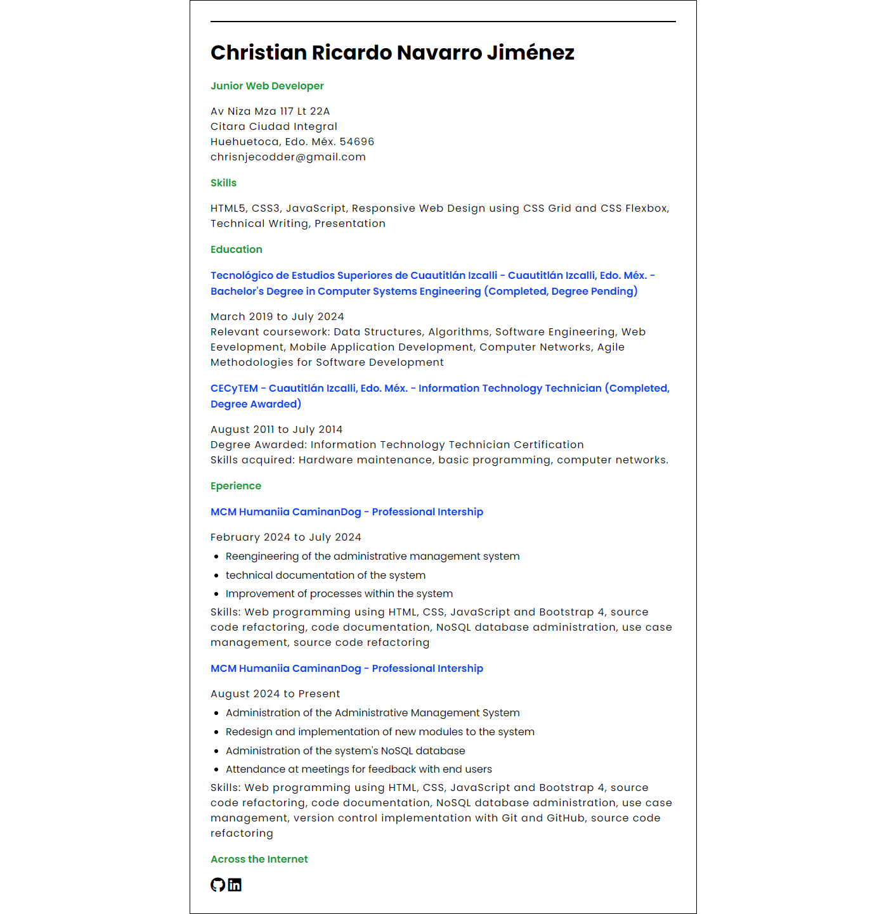

## Single-Page CV

This project is to structure a simple html web page in which a CV is built in a simple way, so that the elements in it can be seen and the HTML tags are better understood.
A slight style is given by applying CSS to improve the way it is displayed a little but keeping the simplicity of the same.

Thanks for watching!